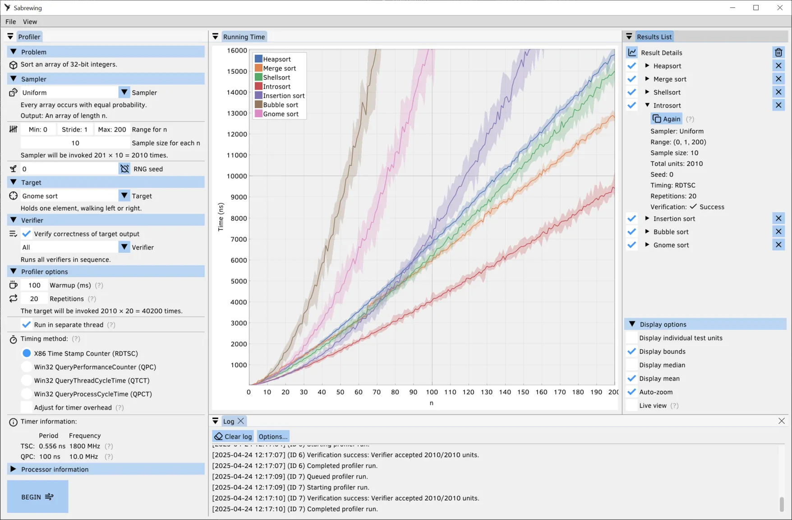

Sabrewing
=========

This is an algorithmic profiler for x86-64 systems running Windows or Linux. It's a **very early
prototype** and not ready for serious use.

An algorithmic profiler measures the running time of a program as a function of the size of its
input (or, more generally, as a function of an arbitrary parameter on the set of all possible
inputs). The most basic use case is to get an empirical measure of a program's average time complexity with respect to a given probability distribution on its input.

This project aims to facilitate the development of algorithms by making it simple to visualize and
compare their performance characteristics.

Screenshot
----------

Installation
------------

To build and run on Winows, install MSVC, and from a Developer Command Prompt run:

    > .\build.bat
    > cd build
    > .\sabrewing.exe

To build and run on Linux:

    $ make
    $ cd build
    $ ./sabrewing

Profiling Tips
--------------

It can be challenging to get consistent results when profiling modern hardware, but there are a few
ways to increase your odds.

- Poor repeatability is often caused by dynamic frequency scaling: The CPU will transition to a
  higher "boost" frequency shortly after the workload begins, but remain there only temporarily due
  to constraints on energy usage and/or heat dissipation. Frequency scaling tends to be especially
  agressive on mobile devices. You can temporarily disable it (to some extent) either in your
  BIOS/UEFI settings or through your operating system. There may be multiple features that require
  disabling; look for phrases like "processor power management", "CPU throttling", and "performance
  boost mode". On Windows, sometimes these settings are hidden until you modify some associated
  registry values.

- Beware thermal throttling---especially on laptops. If overheating becomes a problem, either shrink
  your workloads or improve your system's cooling.

- Disable items like "CPU Clock Spread Spectrum" and "SB Clock Spread Spectrum" in your motherboard
  settings. These feature deliberately introduce jitter into the clock, modulating the frequency by
  as much as 1%. There is typically no harm in leaving spread spectrum disabled (its main purpose is
  to reduce narrow-band EM emissions for regulatory compliance).

- To minimize process pre-empting by the operating system, it's best to shut down other applications
  such as web browsers, especially if you're profiling multi-threaded code that can use all
  available CPU cores.

- Try experimenting with the timing method settings in the profiler.

- It can be helpful to disable "Run in separate thread" under "Profiler options". This will make the
  application more awkward to use but might give significantly cleaner results.
